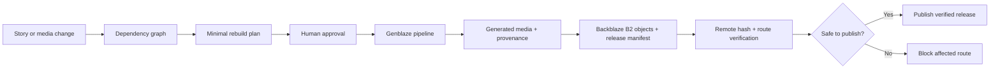

# Branchline

**Change one scene. Rebuild only what it affects. Publish no stale branches.**

[Live Demo](https://branchline-compiler-mneang.onrender.com) ·
[GitHub Repository](https://github.com/mneang/branchline-compiler) ·
[Backblaze B2](https://www.backblaze.com/cloud-storage) ·
[Genblaze](https://github.com/backblaze-labs/genblaze)

Branchline is a release compiler for branching generated media. It traces a source edit through every dependent voice, caption, image, and route preview; rebuilds only what became stale; verifies the finished release in Backblaze B2; and blocks publication when any required object cannot be proven safe.

## The problem

Visual-novel, interactive-comic, and branching-game teams reuse the same scenes across multiple routes. When one shared line changes, the existing voice, caption, and previews do not update automatically.

Teams are left with two bad choices:

- rebuild everything and waste generation calls;
- reuse files blindly and risk publishing an inconsistent story.

A local preview is not enough. The release is only safe when the actual stored objects and every reachable route have been verified.

## Why existing approaches fail

| Approach | Failure |
|---|---|
| Regenerate the full project | Wastes time and generation on unaffected assets |
| Reuse prior media without verification | Can publish stale or missing files |
| Validate only local output | Does not prove the deployed object matches |
| Fail the entire story | Discards routes that are still independently safe |

Branchline instead computes the smallest valid rebuild, preserves verified work, and isolates failures to the routes that depend on them.

## Live demo

Open the [public app](https://branchline-compiler-mneang.onrender.com). No login is required.

| Workflow | Result |
|---|---|
| **Dialogue revision** | 1 shared line changes → 4 assets rebuilt, 2 preserved, 6/6 B2 objects verified, 2/2 routes safe, 0 stale |
| **Visual revision** | Only Ending B changes → 2 rebuilt, 4 B2 objects reused, Ending A remains byte-identical, 0 unnecessary generation requests |
| **Safety check** | 1 required B2 object is missing → Ending B is blocked, Ending A remains independently verified, publication stops |

## Architecture



**Release loop:** Observe → Diagnose → Plan → Approve → Act → Verify → Publish or Block.

## Sponsor technology

### Genblaze

Branchline uses `genblaze-core[audio]` and `genblaze-s3` to:

- execute the generated-media pipeline;
- store canonical generation manifests through the B2 storage sink;
- preserve parent/child run lineage;
- distinguish new generation from verified reuse.

**Provider and model:** Google Gemini TTS, `gemini-2.5-flash-preview-tts`, voice `Kore`.

### Backblaze B2

B2 is the release source of truth, not a passive file bucket.

Branchline uses B2 for:

- content-addressed media objects;
- canonical release manifests and provenance;
- verified reuse across releases;
- short-lived signed playback URLs;
- remote SHA-256 verification;
- missing-object detection that blocks dependent routes.

Backblaze B2 provides S3-compatible object storage, which Branchline accesses through the Genblaze storage integration.

## Measured impact

- **Correct rebuild:** 4 rebuilt · 2 preserved · 6/6 remotely verified
- **Correct reuse:** 4 reused · 0 unnecessary generation requests
- **Correct refusal:** 5 verified · 1 missing · unsafe route blocked
- **Release guarantee:** no stale branch is published

## Screenshots

| Shared change rebuilt correctly | Selective B2 reuse | Publication guard blocks unsafe route |
|---|---|---|
|  |  |  |

## Run locally

Requires Python 3.12.

```bash
git clone https://github.com/mneang/branchline-compiler.git
cd branchline-compiler

python -m venv .venv
source .venv/bin/activate
pip install -r requirements.txt

cp .env.example .env
PYTHONPATH=src:. python app.py
```

Configure the keys listed in `.env.example`:

```text
B2_BUCKET_NAME
B2_KEY_ID
B2_APP_KEY
B2_REGION
B2_ENDPOINT
GEN_PROVIDER_API_KEY
GEMINI_API_KEY
```

Never commit `.env`.

### Verify the project

```bash
PYTHONPATH=src:. pytest -q
python -m compileall -q app.py src scripts tests
```

## Future work

- support larger story graphs, locales, and media types;
- connect the release guard to CI and pull-request workflows;
- add team approvals, notifications, and searchable release history;
- expand Genblaze providers for image, dubbing, and video pipelines.

## License and assets

Released under the [MIT License](LICENSE).

The Branchline demo story, artwork, interface, and generated media are original project assets.
